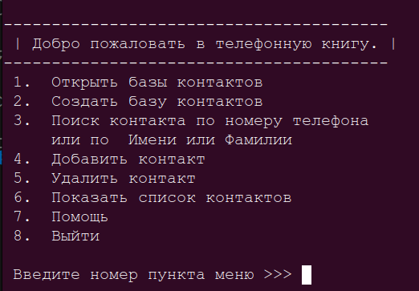

# Учебная программа "Телефонный справочник"

## Описание
Программа для ведение телефонного справочника. В программе реализовано отрытие, создание справочника, удаление и добавление контакта, а также просмотр контактов. Интерфейс программы консольный, работаю в ОС Ubuntu. В роли БД используется формат Json, можно разделить справочники по файлам (категориям). Для кросплатформенности использовал библиотеку pathlib.

## Запуск программы
для ОС Линукс   
~~~
python3 main.py
~~~

для ОС Windows 
~~~
python3.exe main.py
~~~

